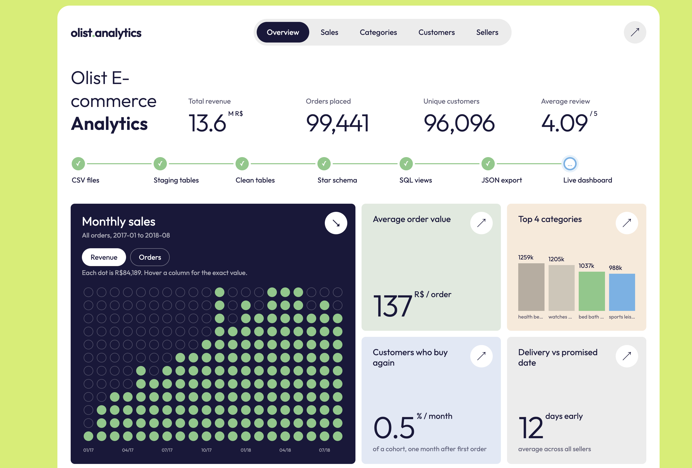
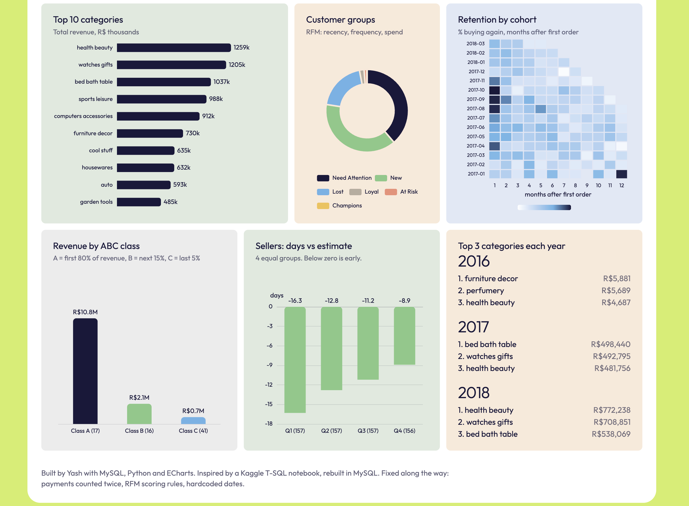

# Olist E-commerce Analytics

A MySQL star schema and SQL analytics project on the Brazilian Olist marketplace dataset (about 100k orders, 2016 to 2018), with a dashboard built in ECharts.

**Live dashboard:** https://yash-buddy.github.io/olist-analytics/viz/




## Pipeline

```text
9 Kaggle CSVs -> staging tables -> clean tables -> star schema -> SQL views -> JSON -> ECharts dashboard
```

| Step | What it does | Files |
|---|---|---|
| Staging | Loads the 9 CSVs as-is into `stg_*` tables with pandas | `python/load_csv.py` |
| Clean | Fixes types, removes duplicate reviews, translates category names | `sql/01_clean.sql`, `sql/01b_fix_types.sql` |
| Star schema | `dim_date`, `dim_customer`, `dim_product`, `dim_seller`, plus two fact tables | `sql/03_star.sql` |
| Views | Window-function analytics (LAG, RANK, NTILE, ROW_NUMBER) | `sql/05_views.sql` |
| Cohort fix | Indexes and cohort tables so the retention view runs fast | `sql/07_cohort_fix.sql` |
| Checks | Totals and quartile sanity checks | `sql/08_remaining_checks.sql` |
| Export | Runs the dashboard queries and writes JSON | `python/export_json.py` |
| Dashboard | Static page that reads the JSON | `viz/index.html` |

## What I found

- **Customers rarely come back.** Retention one month after the first order is under 1% for every cohort. Of the RFM segments, most customers fall into "Need Attention" or "New", and only a few hundred are "Champions".
- **Top categories changed.** `bed_bath_table` led in 2017 and `health_beauty` led in 2018.
- **Revenue is concentrated.** A small group of categories (ABC class A) brings in most of the revenue.
- **Sellers deliver early on average.** Even the slowest quarter of sellers beats the estimated date.
- **2016 is excluded from growth charts.** December 2016 had almost no sales, so month-over-month growth for January 2017 is meaningless (about 1.1 million %).

## Problems I fixed

The project started from a Kaggle T-SQL (SQL Server) script, rebuilt in MySQL. Along the way I fixed:

| Problem | Fix |
|---|---|
| Payment totals were repeated on every order item, so revenue was double-counted | Two fact tables with different grains: `fact_order_items` (one row per item) and `fact_orders` (one row per order). Items plus freight match payments within about 0.017% (vouchers and rounding) |
| RFM "New Customers" rule could never trigger because of rule order | Reordered the CASE rules |
| NTILE on frequency was wrong, since most customers have one order | Frequency scored with CASE |
| Hardcoded "today" date for recency | Uses `MAX(purchase_ts)` from the data |
| Typo in a column name | Corrected |
| Two translation CSVs, one without a header | Kept the one with a header |
| IDs loaded as TEXT, which MySQL cannot index | Converted to `VARCHAR(32)` before adding keys |
| Joins hung on unindexed columns | Added indexes |

## Run it yourself

1. Download the 9 CSVs from Kaggle: "Brazilian E-Commerce Public Dataset by Olist". Put them in `data/` (this folder is not in the repo).
2. Create the database: `CREATE DATABASE olist;`
3. Install packages: `pip install pandas sqlalchemy pymysql cryptography mysql-connector-python`
4. Load and build:

```bash
python3 python/load_csv.py
mysql -u root -p olist < sql/01_clean.sql
mysql -u root -p olist < sql/01b_fix_types.sql
mysql -u root -p olist < sql/03_star.sql
mysql -u root -p olist < sql/05_views.sql
mysql -u root -p olist < sql/07_cohort_fix.sql
python3 python/export_json.py
```

5. Open the dashboard:

```bash
cd viz
python3 -m http.server 8000
```

Then visit `http://localhost:8000`.

## Tools

MySQL 8, Python (pandas, SQLAlchemy), ECharts, Tailwind CSS.

## Credit

Inspired by a Kaggle T-SQL notebook on the Olist dataset, rebuilt in MySQL. Data: Olist and André Sionek, via Kaggle.
